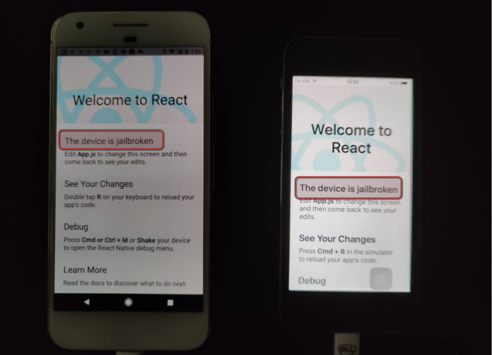

# ReactNative-Jailbrek-Detection

```bash
# Setting up
git clone https://github.com/0xBloodHound/ReactNative-Root-and-Jailbrek-Detection
cd ReactNative-Root-and-Jailbrek-Detection
npm install
cd ios
pod install

# Start debugging Server
cd /path/to/ReactNative-Root-and-Jailbrek-Detection
npx react-native start

# Run Android Application
cd /path/to/ReactNative-Root-and-Jailbrek-Detection
npx react-native run-android

# Run iOS Application, Open the project by xcode
./ios/ReactNativeJailbrekDetection.xcworkspace
```


